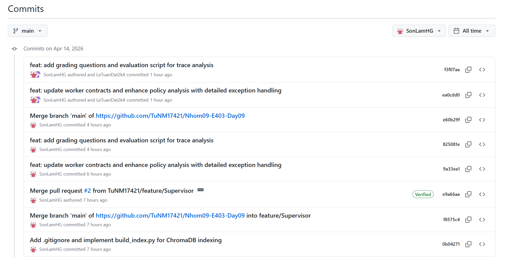

# Báo Cáo Cá Nhân — Lab Day 09: Multi-Agent Orchestration

**Họ và tên:** Hoàng Sơn Lâm  
**Vai trò trong nhóm:** Supervisor Owner  
**Ngày nộp:** 14/04/2026  
**Độ dài yêu cầu:** 500–800 từ

---

## 1. Tôi phụ trách phần nào?

**Module/file tôi chịu trách nhiệm:**
- File chính: `graph.py` — toàn bộ kiến trúc Supervisor-Worker orchestrator.
- Functions tôi implement: `AgentState` (shared state schema), `supervisor_node()` (routing logic), `route_decision()` (conditional edge), `make_initial_state()`, `build_graph()` (graph runner), `run_graph()` và `save_trace()`.
- File phụ: `build_index.py` — pipeline tạo ChromaDB index từ tài liệu nội bộ, gồm `split_by_sections()` chia document theo header và `build_index()` tạo embedding + lưu vào ChromaDB.
- File phụ: `eval_grading_trace.py` — script chạy grading questions và phân tích trace (359 dòng).

**Cách công việc của tôi kết nối với phần của thành viên khác:**
`AgentState` trong `graph.py` là schema chung mà tất cả workers của **Lê Tuấn Đạt** (Worker Owner) đều nhận và trả về. Routing logic của tôi quyết định câu hỏi nào đi vào worker nào — nếu route sai, worker nhận câu sai domain và answer sẽ vô nghĩa. **Nguyễn Mạnh Tú** (MCP Owner) phụ thuộc vào flag `needs_tool` để trigger MCP tools. **Lưu Linh Ly** (Trace Owner) phụ thuộc vào format trace từ `save_trace()`.

**Bằng chứng:** Commits `0b04271`, `ea0cdd0`, `f3f07aa`.


---

## 2. Tôi đã ra một quyết định kỹ thuật gì?

**Quyết định:** Implement context-aware refund routing thay vì keyword matching đơn giản cho các câu hỏi liên quan "hoàn tiền"/"refund".

**Lý do:**
Ban đầu, routing logic chỉ check đơn giản `if "hoàn tiền" in task` rồi route thẳng sang `policy_tool_worker`. Vấn đề là câu hỏi thuần thông tin như *"Điều kiện hoàn tiền là gì?"* cũng bị route sang policy worker — trong khi chỉ cần retrieval là đủ. Tôi có 3 phương án:

1. **Keyword matching đơn giản** — nhanh (~5ms) nhưng over-trigger, route sai câu info.
2. **LLM classification** — chính xác nhưng thêm ~800ms latency mỗi lần route.
3. **Context-aware patterns** — "hoàn tiền" chỉ route sang policy khi đi kèm cụm từ thể hiện ý định check policy như "được không", "yêu cầu hoàn tiền vì", "có thể hoàn".

Tôi chọn phương án 3 vì giữ được tốc độ ~5ms của keyword matching mà vẫn tránh over-trigger.

**Trade-off đã chấp nhận:**
Danh sách pattern có thể chưa bao phủ hết edge cases, nhưng đủ chính xác cho 15 test questions + 10 grading questions của lab.

**Bằng chứng từ trace/code:**
```python
# graph.py:112-127
refund_policy_patterns = [
    "được không", "có được không", "có thể hoàn", "yêu cầu hoàn tiền vì",
    "xin hoàn", "không được hoàn",
]
has_refund_keyword = "hoàn tiền" in task or "refund" in task
has_refund_policy_context = any(p in task for p in refund_policy_patterns)
if has_refund_keyword and has_refund_policy_context:
    matched_policy_kw.append("hoàn tiền + policy context")
```

Kết quả: câu *"Khách hàng Flash Sale yêu cầu hoàn tiền vì sản phẩm lỗi — được không?"* route đúng sang `policy_tool_worker` (match "được không"), còn câu info thuần về hoàn tiền ở lại `retrieval_worker`.

---

## 3. Tôi đã sửa một lỗi gì?

**Lỗi:** Embedding dimension mismatch giữa `build_index.py` (384 chiều) và `workers/retrieval.py` (1536 chiều) khiến retrieval trả về 0 chunks.

**Symptom (pipeline làm gì sai?):**
Khi chạy pipeline, `retrieval_worker` luôn trả về `retrieved_chunks: []` và `retrieved_sources: []` cho mọi câu hỏi. Synthesis worker phải tạo câu trả lời mà không có evidence nào — dẫn đến answer chất lượng rất thấp hoặc hallucination.

**Root cause (lỗi nằm ở đâu?):**
`build_index.py` (commit `0b04271`) tôi viết dùng `SentenceTransformer("all-MiniLM-L6-v2")` tạo embedding 384 chiều. Nhưng `workers/retrieval.py` lúc đó dùng OpenAI `text-embedding-3-small` tạo vector 1536 chiều. Khi query ChromaDB bằng vector 1536d trên index 384d, cosine distance không có ý nghĩa → trả về 0 kết quả. Thêm vào đó, fallback random embedding cũng hardcode 1536 chiều thay vì 384.

**Cách sửa (commit `ea0cdd0`):**
1. Đổi `_get_embedding_fn()` trong `retrieval.py` — ưu tiên `SentenceTransformer` trước để khớp với index.
2. Thêm `_cached_embed_fn` global cache tránh load model mỗi query.
3. Sửa fallback dimension từ 1536 → 384.
4. Tăng `DEFAULT_TOP_K` từ 3 → 5 để lấy thêm context.

**Bằng chứng trước/sau:**
Trước khi sửa:
```python
# retrieval.py (cũ)
DEFAULT_TOP_K = 3
def _get_embedding_fn():
    from openai import OpenAI  # → 1536d, không khớp index 384d
    ...
    def embed(text): return [random.random() for _ in range(1536)]
```
Sau khi sửa:
```python
# retrieval.py (commit ea0cdd0)
DEFAULT_TOP_K = 5
_cached_embed_fn = None
def _get_embedding_fn():
    from sentence_transformers import SentenceTransformer  # → 384d, khớp index
    model = SentenceTransformer("all-MiniLM-L6-v2")
    ...
    def embed(text): return [random.random() for _ in range(384)]
```

---

## 4. Tôi tự đánh giá đóng góp của mình

**Tôi làm tốt nhất ở điểm nào?**
Thiết kế kiến trúc core — `AgentState` schema và routing flow — làm nền tảng cho cả nhóm. Tôi đảm bảo mỗi routing decision đều có `route_reason` ghi rõ keyword nào match, giúp debug rất dễ. Ngoài Sprint 1, tôi cũng đóng góp `build_index.py` và `eval_grading_trace.py` để nhóm có thể index data và chạy grading.

**Tôi làm chưa tốt hoặc còn yếu ở điểm nào?**
Routing vẫn hoàn toàn rule-based với keyword hardcode — không linh hoạt cho câu hỏi phức tạp. Tôi cũng chưa implement LangGraph StateGraph (dùng Python thuần Option A), bỏ lỡ cơ hội dùng conditional edges và interrupt_before cho HITL thực sự.

**Nhóm phụ thuộc vào tôi ở đâu?**
`graph.py` là điểm trung tâm — nếu routing sai, worker nhận câu sai domain và toàn bộ pipeline cho ra answer sai. Nếu `AgentState` schema thay đổi mà không sync, tất cả workers đều break.

**Phần tôi phụ thuộc vào thành viên khác:**
Tôi cần workers của **Lê Tuấn Đạt** hoạt động đúng để pipeline cho ra real answers. Tôi cần MCP tools của **Nguyễn Mạnh Tú** để `policy_tool_worker` có data thực.

---

## 5. Nếu có thêm 2 giờ, tôi sẽ làm gì?

Tôi sẽ nâng cấp routing từ keyword-based sang **hybrid keyword + LLM classification** cho câu multi-hop. Hiện tại, supervisor chỉ route sang **một** worker duy nhất. Với câu dạng gq09 — cần cả thông tin SLA (retrieval) lẫn quy trình cấp quyền (policy) — routing hiện tại chỉ chọn `policy_tool_worker` vì match keyword "cấp quyền", bỏ lỡ context SLA. Với 2 giờ, tôi sẽ thêm một bước LLM nhẹ (~100ms) phát hiện câu multi-hop và route tuần tự qua nhiều workers, cải thiện source coverage cho câu phức tạp.
