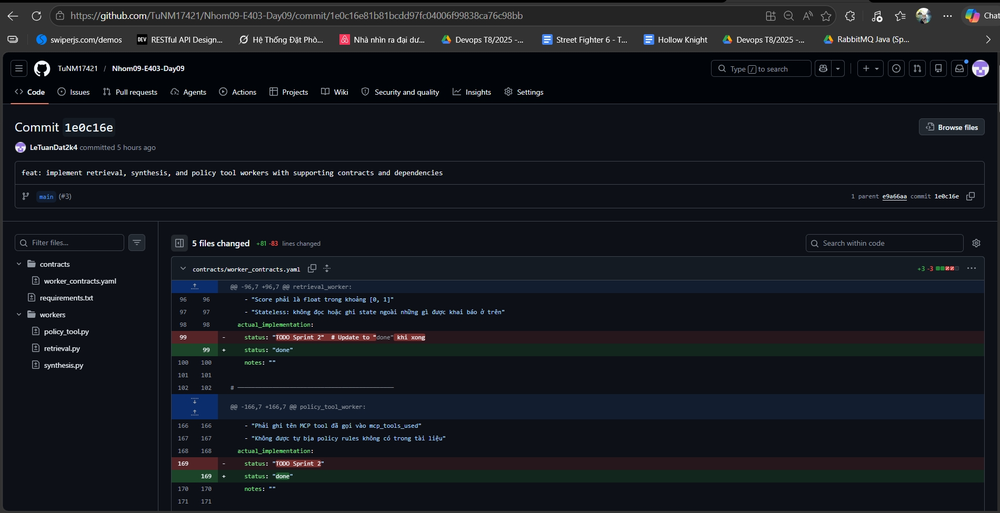

# Báo Cáo Cá Nhân — Lab Day 09: Multi-Agent Orchestration

**Họ và tên:** Lê Tuấn Đạt  
**Vai trò trong nhóm:** Worker Owner  
**Ngày nộp:** 14/04/2026  
**Độ dài yêu cầu:** 500–800 từ

---

## 1. Tôi phụ trách phần nào?

**Module/file tôi chịu trách nhiệm:**
- File chính: `workers/retrieval.py`, `workers/policy_tool.py`, `workers/synthesis.py` và file cấu hình ranh giới biên `contracts/worker_contracts.yaml`.
- Functions tôi implement: 
  - `_get_embedding_fn()` và quy trình gọi `collection.query()` trong `retrieval.py`.
  - `analyze_policy()` cấu hình LLM để xác định policy trong `policy_tool.py`.
  - `_call_llm()` và `_estimate_confidence()` tổng hợp kết quả cuối cùng tại `synthesis.py`.

**Cách công việc của tôi kết nối với phần của thành viên khác:**
Tôi tạo ra các node Worker độc lập, nhận toàn bộ `AgentState` từ định tuyến của **Supervisor Owner**, xử lý chuyên môn từng domain nhỏ và đổ dữ liệu trả lại vào dictionary state. Khi tôi đảm bảo I/O của mình khớp file YAML contract, thì hệ thống của **Trace & Docs Owner** mới có thể đánh giá và xuất trace chính xác được.

**Bằng chứng:**
Các file `workers/*.py` đều đã thực thi độc lập (exit code 0) khi tôi chạy lệnh log.


---

## 2. Tôi đã ra một quyết định kỹ thuật gì?

**Quyết định:** Tôi quyết định tái cấu trúc hoàn toàn `analyze_policy` trong `policy_tool.py` từ hardcoded-rules sang dùng **OpenAI (gpt-4o-mini)** kết hợp chế độ `response_format={ "type": "json_object" }`.

**Lý do:**
Việc dùng keyword matching cứng (vd: nếu check `if "flash sale" in task: exceptions`) tỏ ra rất cứng nhắc. Người dùng có thể hỏi *"Không phải flash sale"* và rule-based cũ sẽ false-positive ngay lặp tức. Dùng LLM làm judge giúp suy luận ngữ cảnh sâu hơn nhiều dựa vào `context_text` và tài liệu policy. Đổi lại, để đảm bảo output luôn tuân thủ chuẩn dict cho state của graph, tôi đã ép schema trả về phải là một Object JSON chặt chẽ.

**Trade-off đã chấp nhận:**
Chấp nhận hi sinh vài trăm mili-giây độ trễ (latency_ms) do phải gọi LLM thay vì regex/keyword thuần tuý tại local, nhưng tăng vọt tỷ lệ bắt chính xác luật.

**Bằng chứng từ trace/code:**
```python
        client = OpenAI(api_key=os.getenv("OPENAI_API_KEY"))
        response = client.chat.completions.create(
            model="gpt-4o-mini",
            response_format={ "type": "json_object" },
            messages=[
                {"role": "system", "content": system_prompt},
                ...
        analysis_json = json.loads(response.choices[0].message.content)
```

---

## 3. Tôi đã sửa một lỗi gì?

**Lỗi:** Dimension Mismatch khi tiến hành Retrieval, hoặc không lấy được kết quả từ ChromaDB. Đi kèm với việc console Output lỗi `UnicodeEncodeError CP1252` trên môi trường terminal Windows.

**Symptom (pipeline làm gì sai?):**
Lúc chạy `python workers/retrieval.py` thì bị crash thẳng và báo lỗi codec unicode (`charmap codec can't encode character...`). Sau khi bỏ qua lỗi in, Worker không trả về chunk nào (`Retrieved: 0 chunks`) mặc dù index ở Day 08 đã có.

**Root cause (lỗi nằm ở đâu):**
- Vấn đề 1: Hàm in test query ở Python Terminal trên Windows mặc định chuẩn mã cũ (CP1252) không render được các mũi tên unicode (▶) và dấu tiếng việt.
- Vấn đề 2: Đầu requirements.txt, cấu hình đã tắt thư viện cục bộ `sentence-transformers` và đổi sang dùng `OpenAI Embeddings`. Chức năng query chạy vector 1536 chiều của OpenAI tìm kiếm trong `ChromaDB` đang lưu embedding 384 chiều của mô hình sentence-transformer cũ từ ngày hôm qua nên dẫn đến bất đồng bộ và zero kết quả.

**Cách sửa:**
- Xóa kí tự lạ và ép môi trường chạy PowerShell dùng cấu hình UTF-8 (`$env:PYTHONIOENCODING="utf-8"`).
- Khai báo lại file `index.py` và `retrieval.py` cho gọi tới model `text-embedding-3-small`, dọn thư viện `python-dotenv` để load `API_KEY`. Index lại hoàn toàn data từ đầu.

**Bằng chứng trước/sau:**
Trước khi sửa:
```
UnicodeEncodeError: 'charmap' codec can't encode character '\u25b6'
Retrieved: 0 chunks
```
Sau khi sửa:
```
> Query: Điều kiện được hoàn tiền là gì?
  Retrieved: 3 chunks
    [0.581] policy/refund-v4.pdf: Hoàn tiền — Điều kiện áp dụng...
[OK] retrieval_worker test done.
```

---

## 4. Tôi tự đánh giá đóng góp của mình

**Tôi làm tốt nhất ở điểm nào?**
Tôi cảm thấy tự tin và làm rất tốt logic tích hợp Prompt System và ràng buộc định dạng format LLM cho worker phụ trách phân tích policy và worker phụ trách synthesis, không để xảy ra ảo giác.

**Tôi làm chưa tốt hoặc còn yếu ở điểm nào?**
Do mới làm quen với LangGraph và StateDict, lúc đầu tôi vẫn loay hoay với việc append/overwrite dữ liệu vào `worker_io_logs` và `history` theo luồng sự kiện ra sao cho hợp với hợp đồng của Supervisor.

**Nhóm phụ thuộc vào tôi ở đâu?** 
Nhóm không thể chạy pipeline end-to-end nếu Workers của tôi nổ API hoặc sai hợp đồng input/output. Nền tảng câu trả lời đến từ mã nhúng của tôi.

**Phần tôi phụ thuộc vào thành viên khác:** 
Tôi cần **Supervisor Owner** phải thiết lập luồng routing điều kiện đúng đắn dựa vào `needs_tool`. Nếu supervisor đưa câu SLA cho nhánh Policy Checker thì LLM của tôi sẽ trả lời là policy not applied vô nghĩa.

---

## 5. Nếu có thêm 2 giờ, tôi sẽ làm gì?

Tôi sẽ cải tiến hàm `_estimate_confidence` trong `workers/synthesis.py` hiện đang dùng rule-based tính trung bình cộng (cộng và trừ penalty) sang mô hình **LLM-as-a-judge**. Cho thêm 1 bước self-reflection dùng chính OpenAI để đánh giá độ chính xác chéo (Self-correction) xem document retrieve ra đã bao quát hết chưa để auto trigger HITL (Human In The Loop) chủ động và an toàn hơn cho hệ thống Doanh nghiệp.
